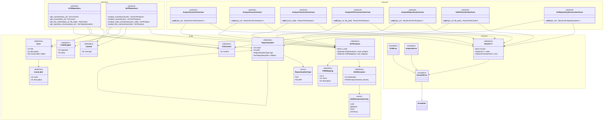

# Dependency Graph

```mermaid
classDiagram
    direction TB

    namespace common {
        class DomainError {
            <<exception>>
        }
        class VCSError {
            <<exception>>
        }
        class AnalysisError {
            <<exception>>
        }
        class Result~T~ {
            <<dataclass>>
            +bool success
            +Optional~T~ value
            +Optional~DomainError~ error
        }
    }

    namespace entity {
        class SASDAnalysisSeverity {
            <<enum>>
            LOW
            MEDIUM
            HIGH
            CRITICAL
        }
        class SASDAnalysis {
            <<dataclass>>
            +str explanation
            +SASDAnalysisSeverity severity
        }
        class CWEMapping {
            <<dataclass>>
            +str id
            +str name
            +str description
        }
        class NLPAnalysis {
            <<dataclass>>
            +bool is_sasd
            +Optional~SASDAnalysis~ sasd_analysis
            +Optional~CWEMapping~ cwe_mapping
        }
        class Commit {
            <<dataclass>>
            +str message
        }
        class IssueLabel {
            <<dataclass>>
            +str name
            +str description
        }
        class Issue {
            <<dataclass>>
            +str title
            +str description
            +list~IssueLabel~ labels
        }
        class CodeSnippet {
            <<dataclass>>
            +str signature
            +str body
        }
        class FileContent {
            <<dataclass>>
            +str content
        }
        class RepositoryItemType {
            <<enum>>
            FILE
            FOLDER
        }
        class RepositoryItem {
            <<dataclass>>
            +str name
            +str path
            +RepositoryItemType type
            +list~RepositoryItem~ children
        }
    }

    namespace repository {
        class VCSRepository {
            <<protocol>>
            +get_commits(repo_url) list~Commit~
            +get_issues(repo_url) list~Issue~
            +get_file_content(repo_url, file_path) FileContent
            +get_repository_structure(repo_url) list~RepositoryItem~
        }
        class NLPRepository {
            <<protocol>>
            +analyze_commits(commits) list~NLPAnalysis~
            +analyze_issues(issues) list~NLPAnalysis~
            +analyze_code_comments(source_code) NLPAnalysis
            +analyze_file_comments(content) NLPAnalysis
        }
    }

    namespace usecase {
        class AnalyzeCommitsUseCase {
            <<protocol>>
            +__call__(repo_url) Result~list~NLPAnalysis~~
        }
        class AnalyzeIssuesUseCase {
            <<protocol>>
            +__call__(repo_url) Result~list~NLPAnalysis~~
        }
        class AnalyzeCommentsUseCase {
            <<protocol>>
            +__call__(source_code) Result~NLPAnalysis~
        }
        class AnalyzeFileCommentsUseCase {
            <<protocol>>
            +__call__(repo_url, file_path) Result~NLPAnalysis~
        }
        class AnalyzeRepositoryUseCase {
            <<protocol>>
            +__call__(repo_url) Result~list~NLPAnalysis~~
        }
        class GetFileContentUseCase {
            <<protocol>>
            +__call__(repo_url, file_path) Result~FileContent~
        }
        class GetRepositoryStructureUseCase {
            <<protocol>>
            +__call__(repo_url) Result~list~RepositoryItem~~
        }
    }

    VCSError --|> DomainError
    AnalysisError --|> DomainError
    DomainError --|> Exception

    Result --> DomainError

    NLPAnalysis --> SASDAnalysis
    NLPAnalysis --> CWEMapping
    SASDAnalysis --> SASDAnalysisSeverity
    Issue --> IssueLabel
    RepositoryItem --> RepositoryItemType
    RepositoryItem --> RepositoryItem

    VCSRepository --> Commit
    VCSRepository --> Issue
    VCSRepository --> FileContent
    VCSRepository --> RepositoryItem
    NLPRepository --> NLPAnalysis
    NLPRepository --> Commit
    NLPRepository --> Issue
    NLPRepository --> CodeSnippet
    NLPRepository --> FileContent

    AnalyzeCommitsUseCase --> Result
    AnalyzeCommitsUseCase --> NLPAnalysis
    AnalyzeIssuesUseCase --> Result
    AnalyzeIssuesUseCase --> NLPAnalysis
    AnalyzeCommentsUseCase --> Result
    AnalyzeCommentsUseCase --> NLPAnalysis
    AnalyzeFileCommentsUseCase --> Result
    AnalyzeFileCommentsUseCase --> NLPAnalysis
    AnalyzeRepositoryUseCase --> Result
    AnalyzeRepositoryUseCase --> NLPAnalysis
    GetFileContentUseCase --> Result
    GetFileContentUseCase --> FileContent
    GetRepositoryStructureUseCase --> Result
    GetRepositoryStructureUseCase --> RepositoryItem
```