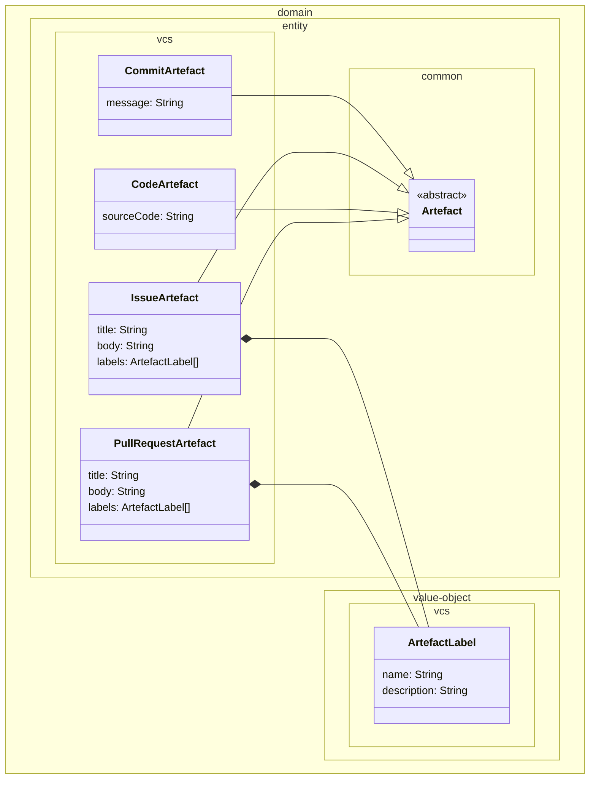
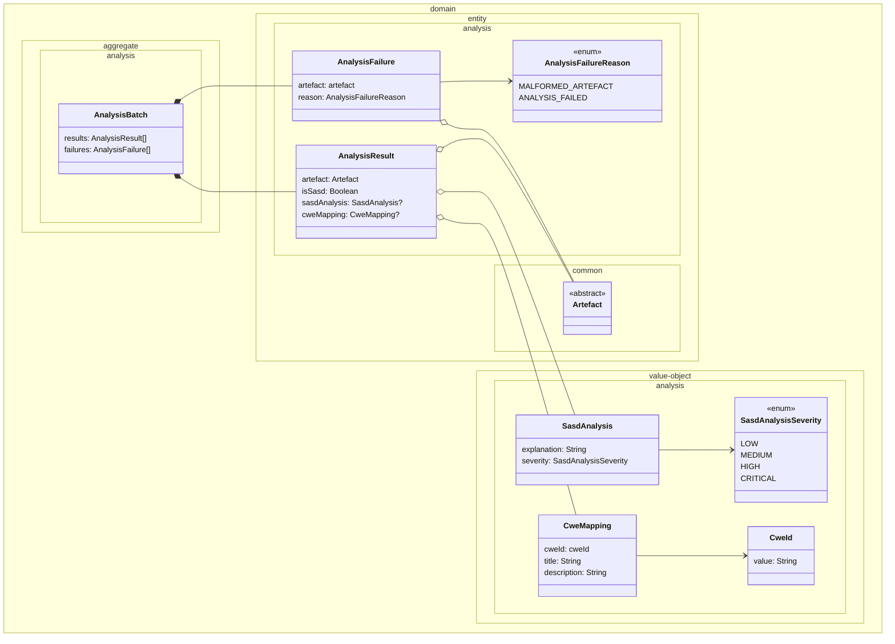

# Entities

## VCS Entities Class Diagram

```mermaid
classDiagram
    namespace domain.entity.common {
        class Artefact {
            <<abstract>>
        }
    }

    namespace domain.entity.vcs {
        class CommitArtefact {
            message: String
        }

        class IssueArtefact {
            title: String
            body: String
            labels: ArtefactLabel[]
        }

        class CodeArtefact {
            sourceCode: String
        }

        class PullRequestArtefact {
            title: String
            body: String
            labels: ArtefactLabel[]
        }
    }

    namespace domain.value-object.vcs {
        class ArtefactLabel {
            name: String
            description: String
        }
    }

CommitArtefact --|> Artefact
IssueArtefact --|> Artefact
CodeArtefact --|> Artefact
PullRequestArtefact --|> Artefact

IssueArtefact *-- ArtefactLabel
PullRequestArtefact *-- ArtefactLabel

```

## NLP Entities Class Diagram

```mermaid
classDiagram

    namespace domain.aggregate.analysis {
        class AnalysisBatch {
            results: AnalysisResult[]
            failures: AnalysisFailure[]
        }
    }

    namespace domain.entity.analysis {

        class AnalysisFailureReason {
            <<enum>>
            MALFORMED_ARTEFACT
            ANALYSIS_FAILED
        }

        class AnalysisFailure {
            artefact: artefact
            reason: AnalysisFailureReason
        }

        class AnalysisResult {
            artefact: Artefact
            isSasd: Boolean
            sasdAnalysis: SasdAnalysis?
            cweMapping: CweMapping?
        }
    }

    namespace domain.entity.common {
        class Artefact {
            <<abstract>>
        }
    }

    namespace domain.value-object.analysis {

        class SasdAnalysisSeverity {
            <<enum>>
            LOW
            MEDIUM
            HIGH
            CRITICAL
        }

        class SasdAnalysis {
            explanation: String
            severity: SasdAnalysisSeverity
        }

        class CweId {
            value: String
        }

        class CweMapping {
            cweId: cweId
            title: String
            description: String
        }
    }

SasdAnalysis --> SasdAnalysisSeverity
CweMapping --> CweId

AnalysisFailure o-- Artefact
AnalysisFailure --> AnalysisFailureReason

AnalysisResult o-- Artefact
AnalysisResult o-- SasdAnalysis
AnalysisResult o-- CweMapping

AnalysisBatch *-- AnalysisResult
AnalysisBatch *-- AnalysisFailure
```
