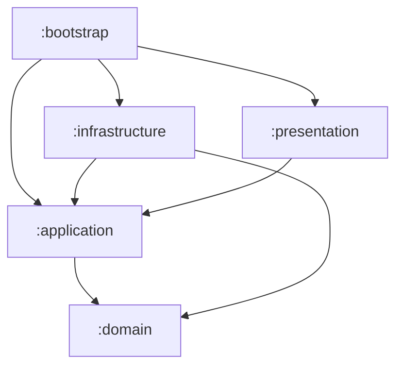

# `sasd-detection-api`

## :clipboard: Overview

`sasd-detection-api` is a **prototype** RESTful backend for the SASD Detection Tool.

## :clipboard: Overview

`sasd-detection-api` is a **prototype** RESTful backend for the SASD Detection Tool. 
It collects repository artefacts (commits, issues, and pull requests) from the GitHub
API, or allows developers to provide code snippets, and passes it through an AI pipeline
to detect instances of Self-Admitted Security Debt (SASD).

Built with Flask using a _Clean Architecture_ and _Domain-drive Design_ approach,
separating presentation, application, domain, and infrastructure concerns.

## :classical_building: Architecture

## Prerequisites

## Getting Started

## API Reference
